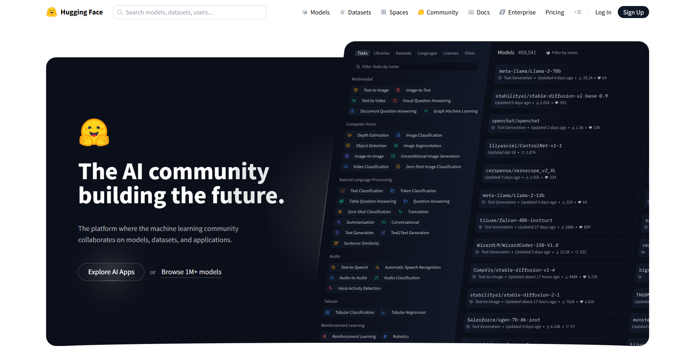
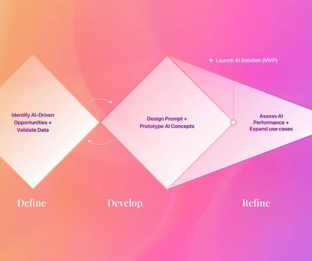

# Guide 
In this Repo We have Provided all the codes From loading Models from transformers(along with thier output), Building , monitoring & deploying modles from scratch


### First Read through basics 
```
-  app/basics.py
```


### Loading Models From Transformers 
```
app/Loading_models.ipynb
```



### Than move on Advanced Stuff
```
- app/First_model/First_model.py
```

